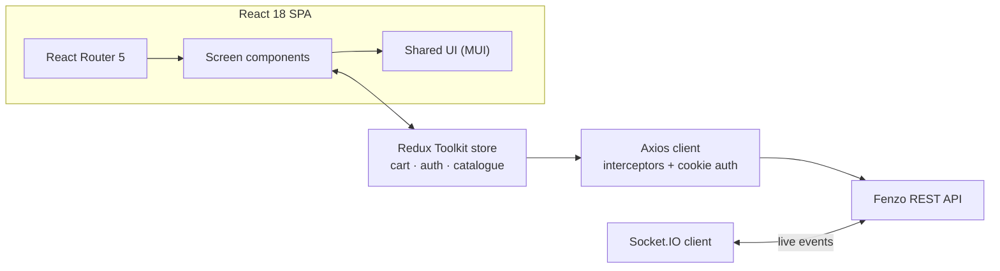

# Fenzo — Customer Web Client

**React storefront for the Fenzo marketplace.** Product browsing and search, cart and checkout, order tracking, wishlists, and a customer account area, backed by a Redux Toolkit state layer.


> API server: **[Fenzo-backend](https://github.com/myx-codes/Fenzo-backend)**

---

## About this project

The customer-facing half of Fenzo. Where the seller dashboard is server-rendered for reliability and indexing, the storefront is a single-page application, because browsing a catalogue is a stateful, high-interaction task where full page loads would be felt on every filter change.

It has not served production traffic. Everything below describes what is implemented in this repository.

---

## What it does

**Catalogue browsing.** Category navigation, keyword search, price and sort controls, and a responsive product grid.

**Cart and checkout.** Cart state persists across navigation, with quantity handling and an order submission flow.

**Order tracking.** Customers view order history, filter by status, and follow orders from pending through delivered.

**Wishlist.** Saved products for later, synchronised with the account.

**Account area.** Profile management, saved addresses, and personal details.

**Multilingual UI.** English, Uzbek, and Korean.

---

## Architecture



**Predictable state.** Redux Toolkit holds cart, session, and catalogue state in typed slices, so cart contents survive navigation and every mutation flows through one reducer path rather than scattered component state.

**Centralised HTTP.** A single Axios instance carries credentials and applies interceptors, keeping auth handling and error handling in one place instead of repeated at each call site.

**Component library over custom CSS.** The UI is built on Material UI so that accessibility, responsive behaviour, and theming come from a maintained system rather than hand-rolled styles.

---

## Tech stack

| Layer | Technologies |
|---|---|
| Framework | React 18, TypeScript |
| Build | Create React App (react-scripts 5) |
| State | Redux Toolkit, React Redux |
| Routing | React Router 5 |
| UI | Material UI, Emotion, styled-components |
| HTTP | Axios, universal-cookie |
| Real-time | Socket.IO client |
| Carousels | Swiper, react-slick |
| Feedback | SweetAlert2 |

---

## Getting started

### Prerequisites

- Node.js 20+
- A running [Fenzo-backend](https://github.com/myx-codes/Fenzo-backend) instance

### Setup

```bash
git clone https://github.com/myx-codes/Fenzo-frontend.git
cd Fenzo-frontend
npm install
```

Create `.env` in the project root:

```
REACT_APP_API_URL=http://localhost:3001
REACT_APP_SOCKET_URL=http://localhost:3001
```

### Run

```bash
npm start          # development server
npm run build      # production bundle
npm run start:prod # serve the production build on port 4002
npm test
```

---

## Repository layout

```
src/
  app/           screen components and routed views
  components/    shared UI components
  store/         Redux Toolkit slices and store setup
  libs/          types, enums, API helpers, configuration
  css/           global styles and theme overrides
```

---

## Author

**Mukhammadyusuf Kholbajonov** — Backend / Full-Stack Engineer
MSc Computer Engineering, Dongguk University, Seoul
[GitHub](https://github.com/myx-codes)
